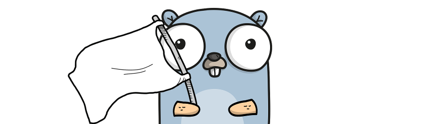

# whiteflag

[](https://travis-ci.com/danielb42/whiteflag)
[](https://godoc.org/github.com/danielb42/whiteflag) 
[](https://goreportcard.com/report/github.com/danielb42/whiteflag) 
[](https://opensource.org/licenses/MIT)  


A sane flag-package for people who just need some CLI flags in Golang projects, not command/argument/option-parsing frameworks for space ships. If you, too, waved a white flag on those, `whiteflag` is here to assist.

## What it does
- provides a method `FlagPresent` to check for specified flags, and methods `Get(Bool|Int|String)` to access their values 
(These methods can be utilized directly without further setup of each flag.) 
- allows you to distinguish between absent and zero-valued flags
- `-h/--help` prints basic generated Usage/Help text (see examples)
- Default values for flags can be specified
- Required flags can be achieved implicitly (see examples)

## Examples
Please have a look at the comprehensive [example source file](example/example.go).  

### Basic
The following snippet would print "gopher" when called with `-p gopher`.
```golang
package main

import wf "github.com/danielb42/whiteflag"

func main() {
    if wf.FlagPresent("p") {
        println(wf.GetString("p"))
    }
}
```

### With long+required+default flags and nice 'Usage' output
The next snippet will print the sum of two integers given through `-x` and `-y`.  
Let's also associate long flags to the short flags so we could equivalently run the snippet with `--first` and `--second`. **Aliasing flags makes them known to the Usage/Help text generation.**  

```golang
package main

import wf "github.com/danielb42/whiteflag"

func main() {
    wf.Alias("x", "first",  "The first number.")
    wf.Alias("y", "second", "The second number.")
    wf.SetIntDefault("y", 42)

    // we don't do a FlagPresent() check on x und y before Get'ting them so 
    // the program will exit if x is not specified, thus making x 'required'.
    // For a missing y flag, the default value of 42 would be used.

    x := wf.GetInt("x")
    y := wf.GetInt("y")
    sum := x + y
    println("sum of x and y:", sum)
}
```

Usage/Help text would be available through `-h/--help`:

```
Usage: ./example <flags>

Flags:
  -x  --first    The first number.
  -y  --second   The second number.
```

## License
MIT
